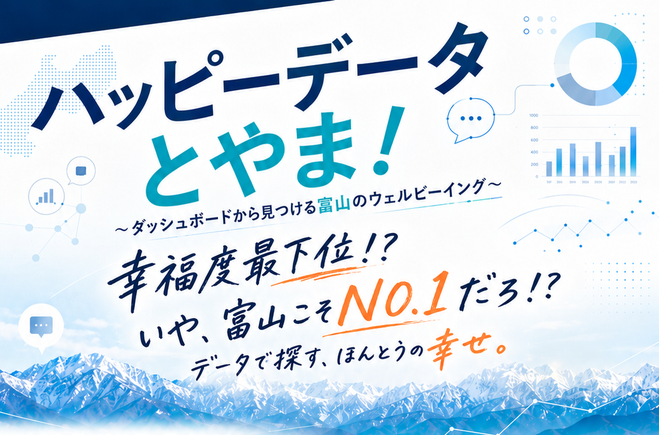
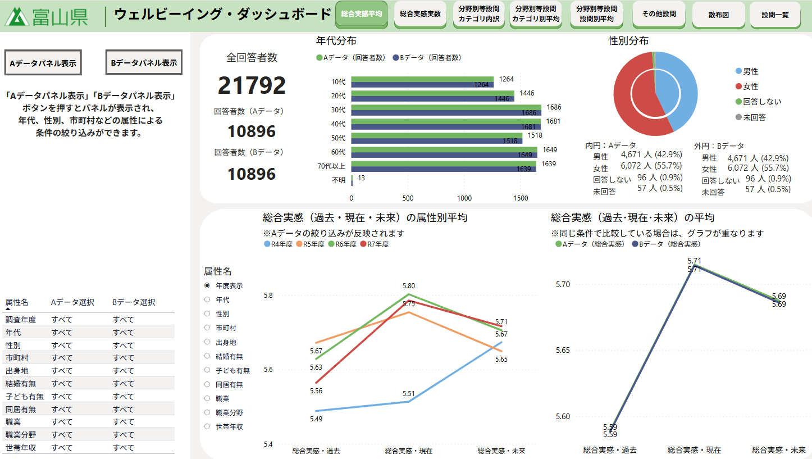
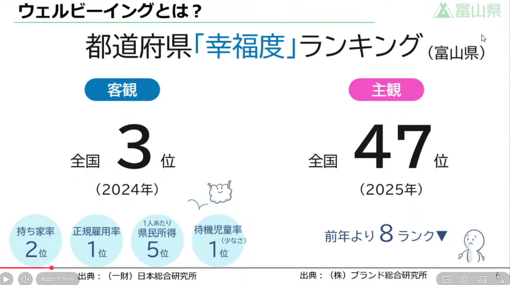
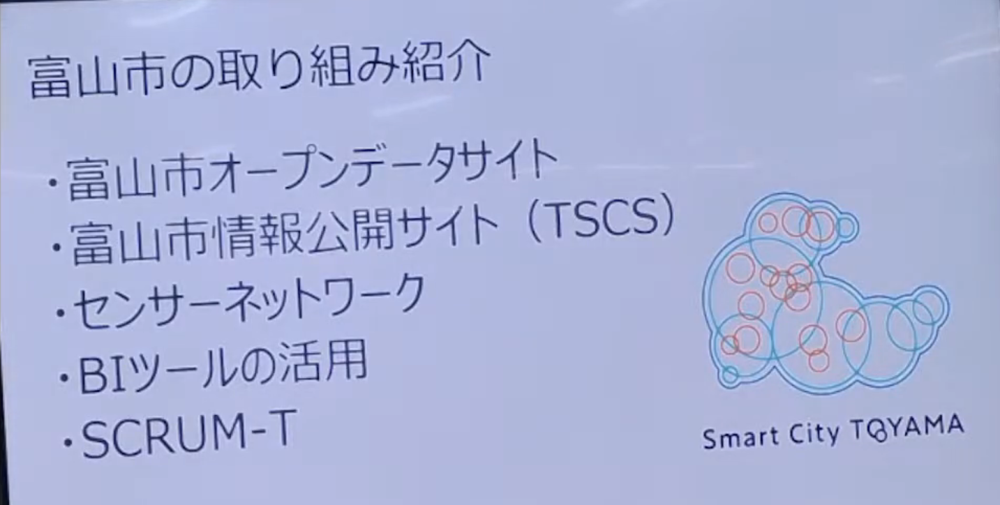
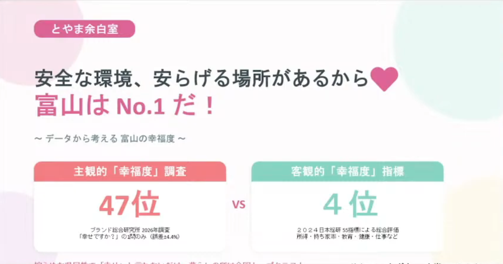
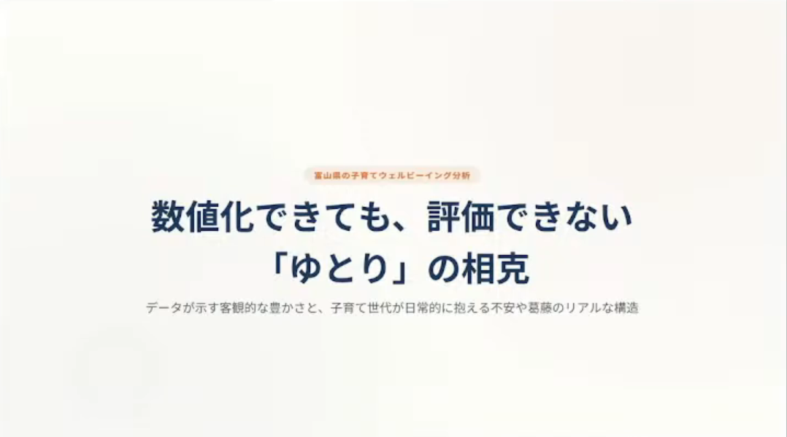
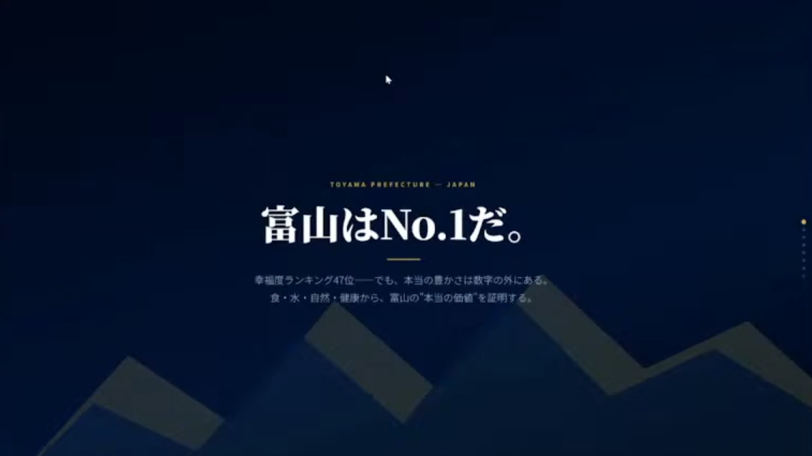
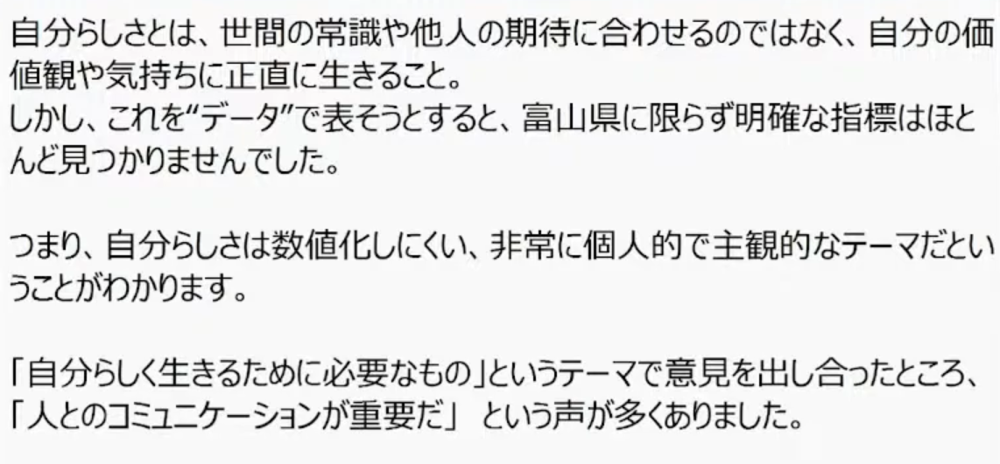
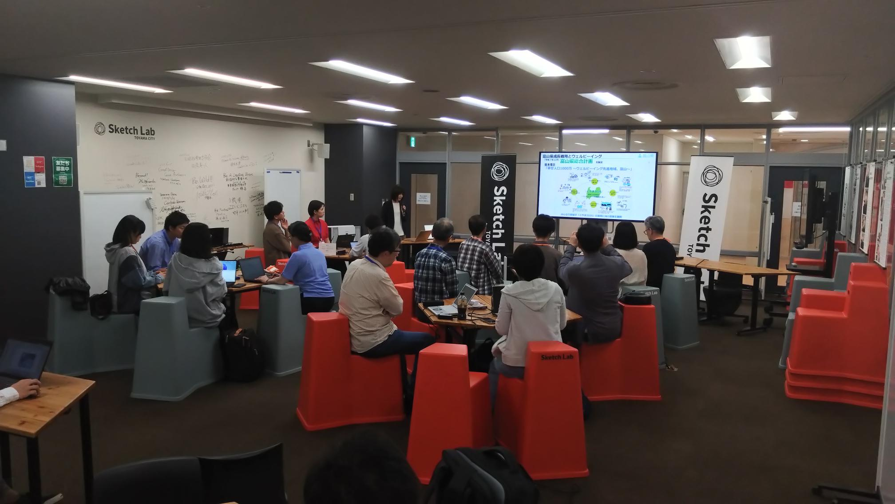

# 「幸福度最下位」の富山で、“富山らしい幸せ”をデータから探してみた  
## ハッピーデータとやま！参加レポート

2026年5月17日、Code for Toyama City 主催のイベント「ハッピーデータ とやま！ 〜富山のNO.1から見つけるウェルビーイング〜」を開催しました。会場は富山駅前の Sketch Lab。テーマは、富山県のウェルビーイングを、ダッシュボードやオープンデータから考えてみよう、というものです。

きっかけは、ブランド総合研究所が発表した「幸福度調査2026」で、富山県が全国47位、つまり最下位になったことでした。調査は「あなたは幸せですか」という主観的な問いへの回答をもとにしたもので、富山は前回39位から47位へと順位を下げたと報じられています。

一方で、富山県は「幸せ人口1000万〜ウェルビーイング先進地域、富山〜」を掲げ、成長戦略の中心にウェルビーイングを据えています。県は、収入や健康といった外形的な価値だけでなく、自己実現、人間関係、地域とのつながりも含めた「自分らしく生き生きと生きられること」を重視してきました。

では、なぜその富山が「幸福度最下位」になったのか。

富山は本当に幸せではないのか。  
それとも、富山の幸せがうまく見える化されていないだけなのか。  
あるいは、富山県民が控えめすぎて、自分たちの幸せを低めに申告しているのか。

そんな問いから、今回のワークショップは始まりました。

富山県では、2025年11月から「ウェルビーイング・ダッシュボード」を公開しています。このダッシュボードでは、県民意識調査や子どものウェルビーイング調査の結果を、年代や性別などで絞り込んだり、設問同士の相関を見たりすることができます。

このダッシュボードを使えば、富山のウェルビーイングをもう少し構造的に捉えられるのではないか。さらに、富山市のオープンデータや各種統計など、客観的なデータを組み合わせれば、「幸福度最下位」というランキングの奥にある本質に近づけるのではないか。

そんな仮説のもと、みんなでデータを見ながら、富山のNO.1を探すワークショップを行いました。

さらに今回は、7月10日に自治体総合フェアで開催予定の「シビックパワーバトル全国大会2026」へのエントリーも意識しました。シビックパワーバトルは、自治体職員と市民が協働し、地域の魅力をデータに基づいて発掘・発表するプレゼンテーションイベントです。2026年大会のテーマも「幸せ／Well-being」。これはもう、富山が出るしかないやつです。

## 県と市からのインプット

前半は、富山県と富山市から、それぞれ取り組みを紹介していただきました。

まず、富山県ウェルビーイング・総合計画推進課から、県のウェルビーイング施策とウェルビーイング・ダッシュボードについて説明していただきました。

印象的だったのは、富山県のウェルビーイング・ダッシュボードが、単に外部委託で作られた広報用ツールではなく、県職員が施策立案のために作っていたものを一般公開した、という話です。

これはとても大事なポイントだと思いました。

見せるためのダッシュボードではなく、考えるためのダッシュボード。  
政策を説明するためだけではなく、政策をつくるためのダッシュボード。

データが行政の中で実際に使われ、それが市民にも開かれているというのは、EBPMのかなり良い姿だと感じました。

続いて、富山市スマートシティ推進課から、富山市のスマートシティやオープンデータの取り組みについて紹介していただきました。

富山市では、さまざまなオープンデータが公開されているだけでなく、消防局予防課でもダッシュボードを作っているという話がありました。県だけでなく、市の現場レベルでもデータ活用が進んでいることがわかり、とても心強く感じました。

正直、こういう話を聞くとうれしくなります。

行政のデータ活用というと、どうしても「専門部署がやるもの」「外部の事業者に作ってもらうもの」という印象になりがちです。でも、県職員や市職員が自分たちの課題を理解するためにダッシュボードを作り、それを施策や業務改善に活かしている。

富山、ちゃんと前に進んでいるじゃないか、と。

## ワークショップ：4つのチームが見つけた“富山の幸せ”

後半は、参加者が4つのチームに分かれ、ダッシュボードやオープンデータを使って、富山のNO.1やウェルビーイングのヒントを探しました。

短い時間でしたが、各チームの視点がかなり違っていて面白かったです。

## チーム1：安全な環境、安らげる場所があるから💛富山はNo.1だ！

発表では、「富山県は安全で安心できる環境があるため、日本一といえるのではないか」という視点が示された。

富山県は、主観的な幸福度では低い結果が出ている一方、客観的な指標では2022年時点で全国4位と高い評価を得ている。つまり、暮らしやすい条件は整っているものの、県民自身がその良さを十分に実感できていない可能性がある。

具体的には、火災発生の少なさや生活保護率の低さ、救急車の現場到着時間の速さなど、安全面で優れた特徴が挙げられた。また、住宅の延べ床面積の広さ、持ち家率の高さ、可処分所得の高さなどから、生活空間や経済面にもゆとりがあると考えられる。

さらに、富山県のウェルビーイングに関するデータでは、10代の幸福度が特に高い点にも注目していた。若い世代が幸福を感じやすい環境があることは、富山県の強みといえる。

人間関係の面では、地域の規模が比較的小さいため顔見知りが多く、孤立しにくい社会であると分析していた。友人関係や家族関係に関する指標も全国平均より高く、三世代同居の割合の高さ、離婚件数やひとり親家庭の少なさなども特徴として挙げられた。

一方、地域とのつながりには課題も見られるが、高齢者のボランティア活動率や地域活動への参加割合は高く、地域内で支え合う力も残っていると述べていた。

以上のことから、富山県には「安全な場所」「安らげる環境」「人とのつながり」が揃っているとまとめられる。今後は、県民がすでにある富山県の良さに気づき、それを実感できるようにしていくことが重要だと結論づけていた。

## チーム2：数値化できても、評価できない「ゆとり」の相克

チーム2は、「ゆとり」に注目した発表でした。

富山は、客観的な指標では豊かに見えるものが多い地域です。住まい、自然、食、勤勉さ、生活基盤。いろいろな面で恵まれている。

でも、それがそのまま幸福につながるかというと、そう単純ではない。

たとえば、働ける環境がある。  
家族や地域の支えがある。  
まじめに努力する文化がある。

それ自体は良いことです。

でも、その裏側に「がんばれる環境があるから、がんばって当たり前」という空気があるとしたらどうでしょうか。

客観指標が高いことは、必ずしも主観的な幸福を意味しない。  
むしろ、恵まれているからこそ、しんどさが見えにくくなることもある。

「数値化できる豊かさ」と「実感としてのゆとり」の間には、ズレがあるのかもしれません。

この発表は、今回のテーマの核心にかなり近かったと思います。

## チーム3：富山はNo.1だ。

チーム3は、とても力強く「富山はNo.1だ」と言い切りました。

富山が持っているものは、間違いなく豊かです。  
水がある。  
山がある。  
魚がうまい。  
米がうまい。  
家が広い。  
自然が近い。  
暮らしの基盤が強い。

客観的に見れば、かなり“超豊か”な地域です。

それなのに、幸福度ランキングでは47位。

このギャップについて、チーム3は、県民の控えめな気質やネガティブ思考がアンケート回答に反映されているのではないか、と考察していました。

たしかに、富山県民は「まあ、こんなもんやちゃ」と言いがちです。

すごく恵まれていても、それを自慢するより、足りないところを先に見てしまう。  
他県から見れば十分すごいことでも、「いやいや、たいしたことない」と言ってしまう。

もしそうだとすると、富山の課題は「幸せがないこと」ではなく、「幸せを幸せとして認識し、言葉にすること」なのかもしれません。

## チーム4：富山県における「自分らしさ」と交流拠点の重要性

チーム4は、ウェルビーイングを「自分らしさ」という視点から考えました。

富山県の成長戦略でも、ウェルビーイングは「自分らしく幸せに生きること」と関係づけられています。

ただ、いざ「自分らしさ」をデータで見ようとすると、なかなかぴったりくる指標が見つからない。

これは本当にそうだと思います。

安全、所得、住宅、健康、教育といった指標は比較的データにしやすい。  
でも、「自分らしくいられるか」「居場所があるか」「何者かにならなくても安心できるか」といったことは、数字にしにくい。

だからこそ、チーム4の視点は面白いものでした。

既存のデータから答えを探すだけでなく、「自分らしさを表すパラメータとは何か」を考える。  
これは、ウェルビーイングを測る側の問いでもあります。

交流拠点の重要性も、ここにつながります。

人と出会える場所。  
何かを始められる場所。  
肩書きではなく、自分の関心で関われる場所。  
そういう場があることは、主観的な幸福や自分らしさに大きく関係しているはずです。

## 「幸福度最下位」は、終わりではなく問いの入口だった

今回のワークショップを通じて感じたのは、「幸福度最下位」という言葉は、富山を否定するものではなく、問いを立てる入口になるということです。

ランキングはわかりやすい。  
だからこそ、強いインパクトがあります。

でも、ランキングだけでは、地域の幸せは語れません。

主観的な幸福度が低いという結果は、もちろん無視できません。  
一方で、富山には客観的に見て豊かな環境や資源がたくさんあります。  
そして、その豊かさが必ずしも実感につながっていないのだとしたら、そこにこそ考えるべきテーマがあります。

富山の幸せは、足りないのか。  
見えていないのか。  
言葉になっていないのか。  
それとも、幸せの形が少し複雑なのか。

データは、答えを出してくれるものではありません。  
でも、問いを深めるための強力な道具になります。

今回、県のウェルビーイング・ダッシュボード、富山市のオープンデータ、各種統計を眺めながら、参加者それぞれが「富山らしい幸せ」を探しました。

その結果、見えてきたのは、単純な「富山すごい」ではありませんでした。

安全だけど、挑戦の場はどうか。  
豊かだけど、ゆとりはあるのか。  
恵まれているけど、自分たちでそれを認めているのか。  
自分らしさを大切にしたいけど、それを測る指標はあるのか。

どれも、すぐに答えが出る問いではありません。

でも、こういう問いを市民と行政が一緒に考えられること自体が、ウェルビーイングな地域の姿なのかもしれません。
