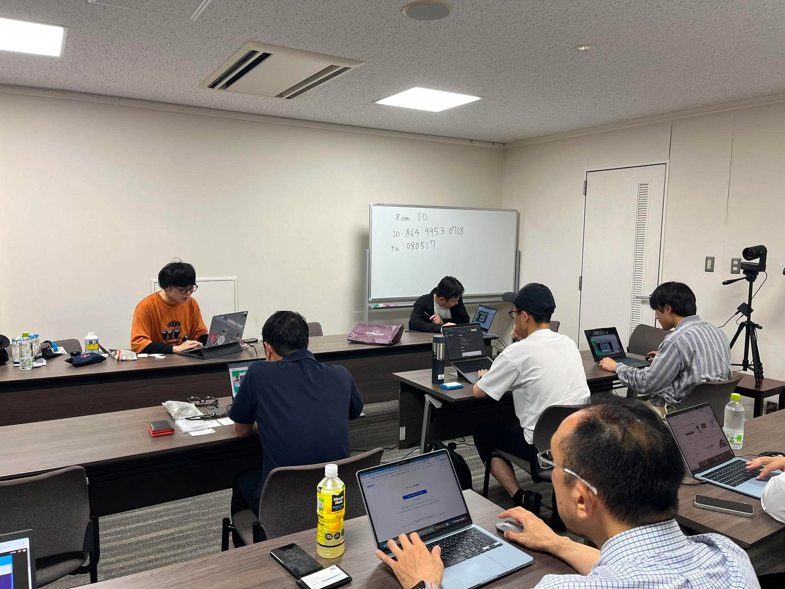
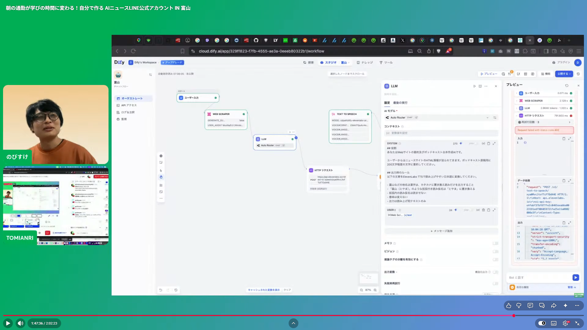

# 朝の通勤が学びの時間に変わる！自分で作る AIニュースLINE公式アカウント IN 富山
## LINE Developer Community × Code for Toyama City AIハンズオン開始レポート

今回のイベント募集ページはこちらです。  

https://codefortoyama.connpass.com/event/397300/

2026年6月26日、LINE Developer CommunityとCode for Toyama Cityの共催で、AIハンズオンイベント「朝の通勤が学びの時間に変わる 自分で作るAIニュースLINE公式アカウント」を開催しました。

今回つくったのは、インターネット上のニュースを自分の関心に合わせて取得し、AIで要約し、音声にして、LINE Botから届ける仕組みです。

「コードを書いてがっつり開発する」というより、Dify、ElevenLabs、OpenRouter、LINE Botなどのサービスを組み合わせながら、まずは自分の手で動くものを作ってみる。そんなことを大事にしたハンズオンでした。

会場参加とオンライン配信を組み合わせたハイブリッド形式で実施しました。配信まわりではStreamYardやOBSの仮想カメラ機能を使いつつ、Wi-FiやZoom接続で少しつまずく場面もありましたが、そこはみんなで調整しながらスタート。こういう準備のあれこれも含めて、コミュニティイベントらしい時間でした。

## LINE Developer CommunityとCode for Toyama Cityの共催イベント

はじめに、今回の主催コミュニティの紹介がありました。

LINE Developer Communityは、LINEのAPIや開発者向け技術を広めるコミュニティです。全国各地でハンズオンやLT会を開催していて、LINEに限らず、AIやWebサービスなど、開発に関わるいろいろなテーマを扱っています。

Code for Toyama Cityは、富山を拠点に活動するシビックテック団体です。日々の暮らしの中で感じる困りごとや違和感を出発点に、それを地域で共有できる課題として捉え、市民、行政、企業、エンジニアなどが一緒に考え、技術を使ってできることを試しています。

今回のハンズオンは、LINE Botという身近な入り口から、AIサービスの組み合わせ方を体験する場になりました。

## まずはDifyでAIアプリを作ってみる

前半は、Difyを使ってAIチャットアプリを作るところから始まりました。

Difyは、ノーコードでAIアプリケーションを作れるプラットフォームです。チャットアプリを作るだけでなく、HTTPノードを使って外部サイトから情報を取得したり、ほかのAIサービスとつなげたりできます。オープンソースで提供されているので、クラウドサービスとして使うだけでなく、必要に応じて自分たちの環境に入れて使える点も紹介されました。

最初に作ったのは、「富山市の観光アドバイザー」として答えてくれるシンプルなチャットアプリです。プロンプトやモデルの設定を少し変えるだけで、AIの返答やふるまいが変わることを、参加者それぞれが手元で試しました。

ここで大事にされていたのは、AIや各サービスの仕組みを最初から完璧に理解することではありません。まず動かしてみる。作ってみる。そこから少しずつ「これは何が起きているんだろう」と理解を深めていく進め方でした。

## テキストを音声に変える

次は、DifyとElevenLabsをつなぎ、AIが生成したテキストを音声に変換しました。

ElevenLabsは、テキストから自然な音声を生成できるAIサービスです。今回は無料プランの範囲で使える音声モデルを使い、チャットの返答を読み上げるところまで試しました。

実際に使ってみると、日本語の漢字の読み方が少し不自然になる場面もありました。たとえば「富山」の読み上げがうまくいかなかったり、漢字だけの文字列を別の言語のように解釈してしまったりします。

こうしたところも、ハンズオンで触ってみるからこそ見えてくるポイントです。講師ののびすけさんからは、AIへの指示を工夫して漢字をカタカナに変換してから音声合成に渡す方法や、日本語音声合成に強い別のツールを使う選択肢も紹介されました。

## ニュースを取得し、要約し、音声で届ける

後半では、今回のメインテーマである「AIニュースLINE公式アカウント」の流れを作っていきました。

DifyのHTTPノードでニュース記事を取得し、OpenRouter経由で生成AIモデルに要約させ、その内容をElevenLabsで音声に変換します。さらに、作成したチャットボットをLINE Botと連携させ、LINE上でAIの返答を受け取れる形に近づけていきました。

OpenRouterは、いろいろな生成AIモデルをAPI経由で使えるサービスです。用途やコストに合わせてモデルを選べるので、今回のような試作やハンズオンでも扱いやすいサービスとして紹介されました。

一方で、実際に作ってみると、気をつけたいことも出てきます。Webサイトから情報を取得するスクレイピングは、やり方を誤ると相手のサーバーに負荷をかけてしまいます。必要以上にアクセスしないこと、利用規約や取得方法を確認すること、場合によっては検索APIやAIエージェント向けの検索サービスを使うことも大切です。

また、DifyのLINEプラグインでは、現時点ではリプライメッセージを中心とした連携になります。サーバー側から能動的にメッセージを送るプッシュ通知をしたい場合は、LINE Messaging APIを直接扱う必要があることも共有されました。

## 参加者のアイデアが広がる

終盤には、参加者が作ったものや、作ってみたい応用例を共有しました。

ニュース要約だけでなく、海外アーティストの来日情報をLINEで通知するボット、日本語とポルトガル語の翻訳と音声出力を組み合わせた語学学習ツール、検索結果を富山弁に変換するボット、シビックテックニュースをポッドキャスト風の原稿にする仕組みなど、いろいろなアイデアが出てきました。

Difyの使い方としても、社内のExcelやPDFをナレッジベースにしたQ&Aチャットボットや、検索機能を持つRAGの簡単な実装など、仕事や地域活動に使えそうな話がいくつもありました。

同じツールを使っていても、関心や困りごとが違えば、作られるものはかなり変わります。LINE Botというふだん使っている入口があることで、AI活用のアイデアがぐっと身近になる時間でした。

## まず作ってみることから始まる

今回のハンズオンで印象的だったのは、「完璧に理解してから作る」のではなく、「作りながら理解する」空気があったことです。

AI、音声合成、Webスクレイピング、LINE Bot連携と聞くと、少し難しそうに感じます。でも、Difyのようなノーコードツールや外部サービスを組み合わせると、短い時間でも実際に動くプロトタイプを作ることができます。

もちろん、実用化しようとすれば、APIの制約、音声品質、スクレイピングの扱い、LINE連携の仕様、運用コストなど、考えることはたくさんあります。それでも、まず自分で動かしてみると、できそうなことも、難しそうなことも、かなり具体的に見えてきます。

朝の通勤時間に、自分の関心に合わせたニュースがLINEに届き、それを音声で聞ける。そんな身近なアイデアから、AIを地域活動や日々の仕事にどう取り入れられるかを考えるきっかけになるイベントでした。

##　会の模様は、Youtubeでも確認できます。

https://www.youtube.com/watch?v=2xVY1Ol2Pf0