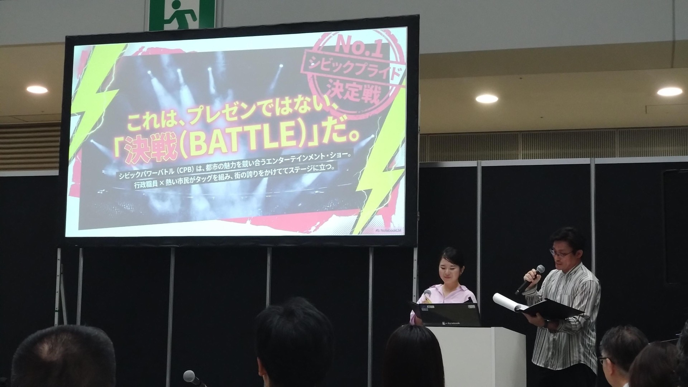
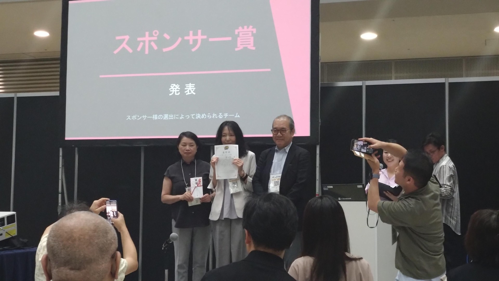

# シビックテックナイト #48 開催レポート

## 概要

定例ミーティングにて、シビックパワーバトル全国大会2026の報告をはじめ、ウェルビーイングに関するデータ活用、AIワークショップ企画、地域課題分析、オープンデータ活用、コミュニティ活動等について意見交換を実施した。

---

# 1. シビックパワーバトル全国大会2026 参加報告

## 発表内容

富山県チームは、ウェルビーイング向上における「つながり」の重要性をテーマとし、地域コミュニティや交流拠点が果たす役割について発表した。

主な論点は以下のとおり。

- ウェルビーイングと人とのつながりの関係
- 地域コミュニティの重要性
- 交流拠点の役割
- データを活用した地域課題の分析

## 大会結果

- スポンサー賞を受賞
- 副賞としてモバイルモニター等を獲得

## 参加を通じて得られた知見

大会では、ウェルビーイングに関するデータ活用や地域課題の捉え方、市民参加型の取り組みなど、多様な事例に触れることができた。

また、地域課題を分析し発信する際には、データとストーリーの両面から伝えることの重要性を再認識するとともに、参加者同士の交流を通じた知見共有の有用性を確認した。

---

# 2. シビックパワーバトル全国大会の内容についてディスカッション

## 現状認識

富山県では、客観的な生活環境指標は高い一方で、主観的な幸福感との間にギャップが見られることが話題となった。

## 主な議論

### ウェルビーイング指標について

ウェルビーイング指標は、

- 家族とのつながり
- 友人とのつながり
- 地域とのつながり
- 安心感
- 仕事や自己実現

などを多面的に評価するものであることを確認した。

### つながりのギャップ

地域における偶発的な出会いや交流機会の不足が、ウェルビーイングに影響している可能性について意見交換が行われた。

また、交流拠点やコミュニティスペースの役割についても議論された。

---

# 3. AIイベント企画

## イベント概要

AIをテーマとしたワークショップ企画について検討を行った。

## 目的

- AIを楽しみながら活用する
- AIの挙動や特性を観察する
- 参加者同士の交流を促進する

## 企画案

参加者自身の

- 面白かったプロンプト
- 想定外の結果が出たプロンプト
- 失敗事例や変わった利用例

などを共有する形式が提案された。

## 検討事項

- 大喜利型イベントとして実施するか
- 観察・実験型とするか
- 学びを重視するか
- エンターテインメント性を重視するか

について意見交換を行った。

## 今後の予定

8月上旬開催を前提として詳細な企画内容を検討していくこととなった。

---

# 4. 富山空港愛称問題
## 「富山高山すし空港」で本当に利用者は増えるのか？
### シビックテック視点で考える富山空港の課題

先日開催したシビックテック関連の集まりで、最近話題となっている「富山高山すし空港」について議論する機会がありました。 

議論を通して感じたのは、「名称変更の是非」そのものよりも、「富山空港をどう活用し、どう維持していくのか」という本質的な課題のほうがずっと重要だということでした。 

---

### 名前を変えれば利用者は増えるのか？

今回の議論で最も多く出た疑問がこれでした。

「高山」や「寿司」という知名度のあるキーワードを空港名に加えること自体は理解できます。しかし、

- それによって何を実現したいのか
- どんな施策につながるのか
- 利用者増加にどう結びつくのか

が十分に説明されていないように見えます。 

本来は、

> この名前だからこそ実施できる施策

が存在して初めて愛称変更が意味を持つはずです。 

---

### 富山県民はなぜ飛行機を使わないのか

議論していて非常に興味深かったのは、実際に利用する側の感覚でした。

富山空港の最大のライバルは、もちろん小松空港ではありません。

**北陸新幹線です。** 

多くの人にとって、

- 東京へ行くなら新幹線
- とりあえず新幹線を予約する
- 飛行機を比較対象にすらしない

という状態になっています。 

さらに、

- 新幹線は予約変更が容易
- 発車本数が多い
- 時間の融通が利く

という圧倒的な利便性があります。 

---

### 実は飛行機の方が有利なケースもある

一方で、飛行機側にも強力なメリットがあります。

例えば、

- 横浜方面
- 羽田空港周辺
- 東京西部

など、目的地によっては飛行機のほうが早く到着できます。 

また、

- 富山空港の駐車場は使いやすい
- 車で直接行ける
- 搭乗までの距離が短い

という地方空港ならではの利点もあります。 

さらに早期予約では、

> 飛行機の方が新幹線より安いケースも少なくない

という話も出ました。 

つまり、

「飛行機は高いし不便」

という認識が必ずしも正しいわけではありません。

---

### 本当に重要なのは東京便

今回の議論で最も印象的だったのがこの話です。

富山空港を維持するうえで重要なのは、

**台湾便でもなく、高山誘客でもなく、まず羽田便。**

という指摘でした。 

理由はシンプルで、

- 定期便が多いほど整備体制を維持できる
- 整備員を常駐できる
- 国際線受け入れ体制の基盤になる

からです。 

つまり、

羽田便が弱くなれば、国際線拡充も難しくなる。

空港経営の観点から見ると、東京便は単なる路線ではなく「空港存続の土台」なのです。 

---

### 「寿司」は本当に海外で魅力になるのか

議論の中で面白かったのがこの視点でした。

日本にいると、

> 富山＝寿司

というイメージがあります。

しかし海外では、

- トロントにも寿司店がある
- 東南アジアにも寿司チェーンがある
- 寿司は既に一般的な食べ物

という状況です。 

もちろん富山の寿司は魅力的です。

しかし、

「寿司があるから富山に行こう」

ではなく、

「富山でしか体験できない何か」

が必要なのではないかという意見が出ていました。 

---

### プライベートジェットという発想

少し夢のある話として、

- 富裕層向けサービス
- プライベートジェット受け入れ
- ハイヤーとの連携

なども話題になりました。 

富山空港は、

- 市街地に近い
- 駐車場が近い
- レンタカーへの導線も良い

という特徴があります。 

「地方空港だから弱い」のではなく、

「地方空港だからできること」

を探したほうが建設的かもしれません。

---

### シビックテックでできること

今回の議論を通じて、個人的に一番面白いと感じたのは、

**感覚ではなくデータで考える**

というアプローチです。 

例えば、

- 黒部市から東京へ行く人は何を選ぶのか
- 富山市民は飛行機を選ぶ可能性があるのか
- 金沢市民は小松空港と富山空港をどう使い分けるのか
- 東京ビッグサイトへ行くなら本当にどちらが早いのか
- 羽田便の利用拡大余地はどこにあるのか

こうしたことを分析すると、新しい発見があるかもしれません。 

---

### 高山・寿司よりも「なぜ使われないのか」

名称変更の議論はどうしても賛成・反対になりがちです。

しかし、本当に考えるべきことは、

- なぜ富山県民は飛行機を選ばないのか
- なぜ新幹線に流れるのか
- どうすれば空港利用が増えるのか

という点です。 

場合によっては、

- 東京便の利用促進
- 富山空港利用圏の可視化
- 高山・飛騨地域との連携
- 海外富裕層向けサービス

など、名称変更とはまったく違う場所に解決策があるかもしれません。 

---

## おわりに

今回の議論で参加者の多くが共有していたのは、

> 「高山」「寿司」を付けること自体が問題なのではない。
>
> その先にどんな戦略があるのかが見えないことが問題なのではないか。

という視点でした。 

空港名を変えることは目立ちます。

しかし本当に必要なのは、

- 誰に使ってもらうのか
- どんな価値を提供するのか
- なぜ富山空港を選ぶのか

をデータに基づいて考えることなのかもしれません。 

富山空港は「名前の問題」ではなく、「戦略の問題」。

そんなことを改めて考えさせられる議論でした。 

---

# 5. コミュニティ運営・今後の活動

## Code for Japanのパートナーシップ継続

コミュニティ活動継続に関する各種手続き状況や運営体制について確認を行った。

## 活動状況共有

以下の活動状況が共有された。

- プログラミング教育支援
- ロボット教育支援
- 地域イベントへの協力

## 今後のイベント参加

以下のイベントや活動への参加について情報共有を行った。

- アーバンデータチャレンジ
- シビックテック関連イベント
- 地域データ利活用活動

---

# 今後の予定

## AIイベント

- 開催日程の確定
- ワークショップ内容の具体化
- 協力メンバーとの調整

## データ活用

- 地域課題分析データの整理
- 可視化方法の検討
- イベントや発表での活用検討

## シビックテック活動

- ウィキペディアタウン実施可能性の検討
- アーバンデータチャレンジ企画検討
- コミュニティ活動の継続

---

# 総括

今回の会合では、シビックパワーバトル全国大会の報告をはじめ、ウェルビーイング、AI活用、地域ブランディング、オープンデータ活用など幅広いテーマについて活発な意見交換が行われた。

また、データを活用した地域課題の把握や、市民参加による共創活動の重要性を再認識するとともに、今後の地域活動やシビックテック推進につながる多くの示唆を得る機会となった。